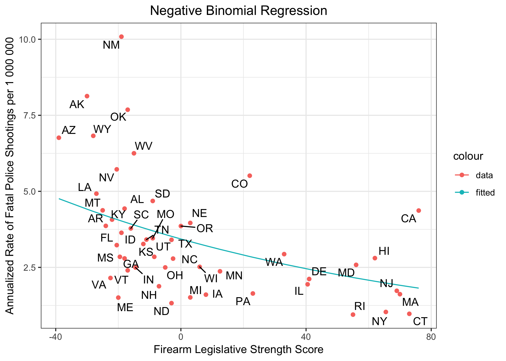
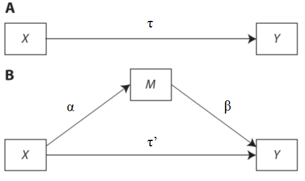

```{r setup, include=FALSE}
knitr::opts_chunk$set(echo = TRUE)
```
# Motivation
We will recreate a study by the American Journal of Public Health ["to examine whether stricter firearm legislation is associated with rates of fatal police shootings."](https://ajph.aphapublications.org/doi/suppl/10.2105/AJPH.2017.303770)

<center>

</center>


The bulk of this code will consist of collecting, cleaning and manipulating data in order to control for potential covariates. We will also run a Poisson regression and tests of statistical significance.

The libraries used in this study are `dplyr`, `rvest`, `ggplot2`, `zoo`, `openintro`, `readxl`, `data.table`, `mediation`, `MASS`,`ggrepel`, and `kableExtra`. In order to run this code please ensure you have these packages installed.

The learning objectives include data cleaning and manipulation, problem solving, scraping data from the web, cleaning text, merging data frames, Poisson regression and significance testing.

# What is the data?
This study uses data from many different sources.

1. [The Brady Campaign State Scorecard 2015](http://crimadvisor.com/data/Brady-State-Scorecard-2015.pdf): numerical scores for firearm legislation in each state.
2. [The Counted](https://www.theguardian.com/us-news/ng-interactive/2015/jun/01/about-the-counted): Persons killed by police in the US. The Counted project started because "the US government has no comprehensive record of the number of people killed by law enforcement."
3. [US Census](https://www.census.gov/content/census/en/data/tables/2017/demo/popest/state-detail.html): Population characteristics by state.
4. [FBI's Uniform Crime Report](https://ucr.fbi.gov/crime-in-the-u.s/2015/crime-in-the-u.s.-2015/tables/table-5).
5. [Unemployment rate data](https://web.archive.org/web/20210205040250/https://www.bls.gov/lau/lastrk15.htm).
6. [US Census 2010 Land Area](https://www.census.gov/support/USACdataDownloads.html#LND).
7. Education data for 2010 via the [US Census education table. editor](https://factfinder.census.gov/faces/tableservices/jsf/pages/productview.xhtml?src=bkmk).
8. "Household firearm owndership rates, represented as the percentage of firearm suicides to all suicides." Downloaded from the [CDC's Web-Based Injury Statistics Query and Reporting System](https://www.cdc.gov/injury/wisqars/fatal.html).

# Data import
Since this is the first R code chunk, we load all the necessary libraries.
```{r, message=FALSE}
library(dplyr)
library(ggplot2)
library(readxl)
library(data.table)
library(zoo)
library(openintro)
library(rvest)
library(kableExtra)
library(mediation)
```

We import the Census population characteristics data, Brady Campaign Scorecard (2015), "The Counted" data for 2015 & 2016, FBI's crime report for 2015, land area by state from the Census, and suicide rate data. These files were downloaded from their respective websites listed in the above section "What is the data?"

```{r}
census <- read.csv("data/sc-est2017-alldata6.csv",nrows = 236900,stringsAsFactors = FALSE)
head(census[, 1:5])
brady <- read_excel("data/Brady-State-Scorecard-2015.xlsx", sheet = 1)
head(brady[, 1:5])
counted15 <- read.csv("data/the-counted-2015.csv",stringsAsFactors = FALSE)
counted16 <- read.csv("data/the-counted-2016.csv",stringsAsFactors = FALSE)
head(counted15)
crime <- read_excel("data/table_5_crime_in_the_united_states_by_state_2015.xls", sheet = 1,skip = 3)
head(crime[, 1:5])
colnames(crime)[3]<-"rate_stat"
land <- read_excel("data/LND01.xls", sheet = 1)
head(land[, 1:5])
suicide_all <- read.csv("data/suicide_all.csv",stringsAsFactors = FALSE)
head(suicide_all[,1:5])
suicide_firearm <- read.csv("data/suicide_firearm.csv",stringsAsFactors = FALSE)
```


# Data wrangling
## 1. Census Data
### 1.1 Percent Male, White, Black, Hispanic

The following is taken from the document sc-est2017-alldata6.pdf:

  * The key for SEX is as follows:
    + 0 = Total
    + 1 = Male
    + 2 = Female

  * The key for ORIGIN is as follows: 
    + 0 = Total
    + 1 = Not Hispanic
    + 2 = Hispanic

  * The key for RACE is as follows:
    + 1 = White Alone
    + 2 = Black or African American Alone
    + 3 = American Indian and Alaska Native Alone
    + 4 = Asian Alone
    + 5 = Native Hawaiian and Other Pacific Islander Alone
    + 6 = Two or more races

Here we use the `dplyr` package to `filter`, `group_by`, and `summarize` the data in order to calculate the necessary statistics.
For each state, we add rows in the column `POPESTIMATE2015` since we are looking at the year 2015.
Setting the `ORIGIN` or `SEX` equal to 0 ensures we don't add duplicate data, since 0 is the key for both Hispanic and non Hispanic residents and total male and female residents.
We group by each state since all data in this study should be at the state level.
```{r}

census_stats <- census %>%
  filter(ORIGIN == 0, SEX == 0) %>%
  group_by(NAME) %>%
  summarize(white = sum(POPESTIMATE2015[RACE==1])/sum(POPESTIMATE2015)*100,
            black = sum(POPESTIMATE2015[RACE==2])/sum(POPESTIMATE2015)*100)

census_stats$hispanic <- census %>%
  filter(SEX == 0) %>% 
  group_by(NAME) %>%
  summarize(x = sum(POPESTIMATE2015[ORIGIN==2])/sum(POPESTIMATE2015[ORIGIN==0])*100) %>%
  pull(x)

census_stats$male <- census %>%
  filter(ORIGIN == 0) %>%
  group_by(NAME) %>%
  summarize(x = sum(POPESTIMATE2015[SEX==1])/sum(POPESTIMATE2015[SEX==0])*100) %>%
  pull(x)

census_stats$total_pop <- census %>%
  filter(ORIGIN == 0, SEX == 0 ) %>%
  group_by(NAME) %>%
  summarize(total = sum(POPESTIMATE2015)) %>%
  pull(total)

census_stats$NAME <- tolower(census_stats$NAME)

head(census_stats)
```
### 1.2 Median Age
First we need to get the total counts for each age (per state), since that's divided up into all the other categories.
We set `ORIGIN` and `SEX` to "Total" so we don't have repeats in the data then group by state and age since these are the two factors we need to keep seperated.
The column `sum_ages` is the total residents in each specified state for each age.
```{r}
age_stats <- census %>%
  filter(ORIGIN == 0,SEX == 0) %>%
  group_by(NAME,AGE) %>%
  summarize(sum_ages = sum(POPESTIMATE2015))
head(age_stats)
```
We begin to see that finding the median is tricky, since we don't have a nice list of ages (i.e., [22,55,4,27,...,35]) for each state, in which case we could probably use a built in R function. Instead we have the number of people that are ages 0-85+ in each state. For example, the first row of data above says that in Alabama (in 2015), there are 59080 residents that are 0 years old.

To solve this problem we first transform the dataframe to have each state as a column name with the sumAges data underneath. In otherwords we want to transform our 51*86 by 3 dataframe to a 51 by 86 dataframe. We remove the age column since we can use the index instead (index minus 1, since R dataframes are indexed from 1 and the ages start at 0).
```{r}
age_stats <- dcast(setDT(age_stats), AGE ~ NAME, value.var="sum_ages")
age_stats$AGE <- NULL
head(age_stats[,0:5])
```
Now that we've made the data easier to work with, we need to find a way to get the median. One method is to take the cumulative sum of each column and then divide all the rows by the last row in each repective column, calculating a percentile/quantile for each age. Then, we find the age in each state where the population exceeds the 50th percentile (the median!) for the first time.
```{r}
age_stats <- as.data.frame(apply(age_stats, 2, cumsum))
age_stats <- as.data.frame(apply(age_stats,2,function(x) x/x[86]))
head(age_stats[, 1:6])
census_stats$age <- apply(age_stats,2,function(x) which.max(x >= 0.5)-1)

head(census_stats)
```
## 2. Violent Crime
First print the names of the columns to see that there are some extraneous characters not visible in the dataframe. Use the column index to select columns instead of the complicated names.
Also, we print a specified row of violent crime to observe the `X__1` group we are looking for -- `Rate per 100,000 inhabitants` (per the study.)
```{r}
colnames(crime)
violentcrime<- crime[ , c(1,3,5)]
violentcrime[11, ]
```
We need get all rows where `rate_stat == Rate per 100,000 inhabitants`. However, as we can see above, the value for `State` in these rows is `<NA>`, so we need to fill that value with the state name that is listed in a previous row.
Then we can select the rows where `rate_stat == Rate per 100,000 inhabitants`.
After that, we no longer need the column `rate_stat`, so we can remove it.
```{r}
violentcrime$State <- na.locf(violentcrime$State)
violentcrime[11, ]
violentcrime<- subset(violentcrime, rate_stat == "Rate per 100,000 inhabitants")
violentcrime$rate_stat <- NULL
names(violentcrime) <- c("State", "violent_crime")
head(violentcrime)

```
Looking at our whole dataframe we can see some of the state names have numbers in them (an example is printed below). This will make it hard to merge data together, so we should clean this up. We also make the state names all lowercase for ease of merging.
```{r}
violentcrime$State[20]
violentcrime$State<-tolower(gsub('[0-9]+', '', violentcrime$State))
violentcrime$State[20]
```
We start cumulating our data into one dataframe, p_df.
```{r}
p_df <- merge(census_stats,violentcrime,by.x="NAME", by.y = "State")
head(p_df)
```

## 3. Brady Scores
The study by AJPH groups the scores by the 7 categories. The study removed all weightings of the different laws in favor of a "1 law 1 point" system, since the weightings were "somewhat arbitrary."

For the purpose of practice and simplification we just keep the first line of "total state points" from the Brady Scorecard as they are given, thus we note here is where our analysis differs from the study.

We need to transform the data frame so that we have a column of state names and a column of the corresponding total scores.

The scores are characters from the data import, so we change them to numeric.
```{r}
head(brady)
colnames(brady)[1] <- "Law"
brady <- brady %>%
  filter(Law == "TOTAL STATE POINTS")
head(brady)
brady <- brady[,(ncol(brady) - 49):ncol(brady)]
brady_totals <- as_data_frame(colnames(brady))
brady_totals$brady_scores <- t(brady)
colnames(brady_totals)[1] <- "state"
brady_totals$brady_scores <- as.numeric(brady_totals$brady_scores)
head(brady_totals)
```

This dataframe's list of states is in two-letter state abbreviations. Since this is not cohesive with previous data files, we should change it to make merging possible. We use the `openintro` library to do the simple conversion.
```{r}
brady_totals$state <-tolower(abbr2state(brady_totals$state))
head(brady_totals)
p_df <- merge(p_df,brady_totals,by.x="NAME",by.y = "state")
head(p_df)
```

## 4. The Counted Fatal Shootings
First we simply concatenate the two years of data.
```{r}
counted1516 <- rbind(counted15, counted16)
head(counted1516)
```
Again, this data frame's list of states is in two-letter state abbreviations.
```{r}
counted1516$state <-tolower(abbr2state(counted1516$state))
```
In the study, researchers "calculated descriptive statistics for the proportion of victims that were male, armed, and non-White." Thus we repeat here easily with `dplyr`. `tally` is used to count the number of observations in each group.

We also calculate the annualized rate per 1,000,000 residents. Note that the tally is the total shootings per state over 2 years.
```{r}
counted_stats <- counted1516 %>%
  group_by(state) %>%
  filter(classification == "Gunshot") %>%
  tally()

counted_stats$gunshot_filtered <- counted1516 %>%
  group_by(state) %>%
  filter(classification == "Gunshot",raceethnicity != "white", armed != "No", gender == "Male") %>%
  tally() %>%
  pull(n)

colnames(counted_stats)[2] <- "gunshot_tally"
counted_stats$gunshot_rate <- (counted_stats$gunshot_tally/census_stats$total_pop)*1000000/2
head(counted_stats)
p_df <- merge(p_df,counted_stats,by.x="NAME",by.y = "state")
```

## 5. Unemployment Data

This data was available online from the BLS (although since the time that this case study was written, the data is no longer available directly on the US Bureau of Labor Statistics website - hence we will use an archive), but there was no easy download of the table. It is also difficult to simply copy and paste; it doesn't hold it's table format. Thus we set up a web scraper to get the data.

To do this, we must use the `rvest` package. To view the HTML of a webpage, right-click and select "View page source."

Then we get the values from each column of the data table. `html_nodes` acts as a CSS selector. The sub0 class returns the state names, and the datavalue class corresponds to the values of both columns, Unemployment Rank and Rate. Since there is no differentiation of the two columns, and our "datavalues" alternate, we select subsets of this column to be the two seperate columns "rank" and "rate."

```{r}
url <- read_html("https://web.archive.org/web/20210205040250/https://www.bls.gov/lau/lastrk15.htm")
datavalues <- url%>%
  html_nodes('.datavalue') %>%
  html_text() %>%
  as.numeric()

state <- url%>%
  html_nodes('.sub0') %>%
  html_text()

unemployment<-as.data.frame(state[c(2:52)]) 
rate_select <- seq(3,103,by=2)
rank_select <- seq(4,104,by=2)
unemployment$unemployment_rate <- datavalues[rate_select]
unemployment$unemployment_rank <- datavalues[rank_select]
colnames(unemployment)[1] <- "state"

unemployment <- arrange(unemployment, state)
head(unemployment)
```
```{r}
unemployment$state <- tolower(unemployment$state)
p_df <- merge(p_df,unemployment,by.x="NAME",by.y = "state")
```

## 6. Population Density 2015
To manually find population density, we can calculate total 2015 population from the Census data and import land area to calculate population density. This is caculated because "good" data for state population in 2015 was not available in a downloadable format and/or was not easy to scrape.

We select `LND110210D` by looking at the [table](https://www.census.gov/geo/reference/state-area.html) and comparing values on other sites (such as the census or Wikipedia) to find the correct column. This column corresponds to land area in square miles.
```{r}
totalPop <- census %>%
  filter(ORIGIN == 0, SEX == 0 ) %>%
  group_by(NAME) %>%
  summarize(total = sum(POPESTIMATE2015))

landSqMi <- land %>%
  dplyr::select(Areaname,LND110210D) 
  # add the dplyr::select because there exists MASS::select

head(landSqMi)
```
Since `landSqMi` gives us area for each town in addition to the states, we merge on the state names to obtain only the area for each state.

We convert the state names to be all lowercase since the row values must match to merge successfully.
```{r}
names(landSqMi) <- c("NAME", "land_area")

landSqMi$NAME <- tolower(landSqMi$NAME)
totalPop$NAME <- tolower(totalPop$NAME)

popdensity <- merge(totalPop,landSqMi,by="NAME")
popdensity$density <- popdensity$total/popdensity$land_area

popdensity$total <- NULL
popdensity$land_area <-NULL

head(popdensity)

p_df <- merge(p_df,popdensity,by="NAME")
```

## 8. Firearm Ownership
We simply calculate firearm ownership as a percent of firearm suicides to all suicides.
```{r}
ownership_df <- data.frame("NAME" = tolower(suicide_all$State), 
                           "ownership" = suicide_firearm$Deaths/suicide_all$Deaths*100)
head(ownership_df)
p_df <- merge(p_df,ownership_df,by="NAME")
```

# Exploratory data analysis
## 1. Poisson fit
First let's determine if the fatal police shooting data is Poisson distributed. This is possible because the shootings are discrete events over a fixed interval of time.

We take the mean of the fatal shootings to get our parameter $\lambda$. $\lambda$ is the expected value *and variance* of fatal police shootings in each state for the years 2015-16 if they are Poisson distributed.
```{r}
p_df$ones <- 1
(lambda = mean(p_df$gunshot_tally))
expected <- lambda*p_df$ones

```

Now that we've calculated the expected number of shootings, we can use Pearson's chi-squared test (goodness of fit) to see if the data does indeed follow a Poisson distribution. Our test statistic is
$$\chi^2 = \sum_{i=1}^{n} \frac{(O_{i} - E{i})^{2}}{E_{i}}$$
where $O_{i}$ denotes the observed value in state $i$ and $E_{i}$ denotes the expected value in state $i$ if the data is Poisson distributed.
```{r}
chi.squared = (p_df$gunshot_tally - expected)^2/expected
(chi.squared.statistic = sum(chi.squared))
(p.value = pchisq(chi.squared.statistic, 50-2, lower.tail =F))
```
Our resulting test statistic is large so our p-value is very small (so small that it rounds to 0), indicating that we should reject our null hypothesis that the data is Poisson distributed.

Let's repeat this analysis using the R built in glm function results, for both the null model `m0`, the most basic model with the brady scores as the only explanatory variable `m1`, and the full model `mv` with multiple variables. We can simply square the Pearson residuals, $$r_{i} =  \frac{O_{i} - E_{i}}{\sqrt{E_{i}}}$$ to get Pearson's chi-squared statistic as before.

First we fit the null model as we did previously.

```{r}
m0 <- glm(gunshot_tally ~  1,
                  family="poisson", data = p_df)

(chi.squared.stat.m0 = sum(residuals(m0, type = "pearson")^2))
(p.value.m0 = pchisq(chi.squared.stat.m0, 50-2, lower.tail =F))


```
These results reflect our previous results.

Next we fit the simplest model, using the brady scores as our explanatory variable $X$, followed by the multivariate model with statewise sociodemographic characteristics included.
```{r}
m1 <- glm(gunshot_tally ~  brady_scores + 
                  offset(log(total_pop)), 
                  family="poisson", data = p_df)

(chi.squared.stat.m1 = sum(residuals(m1, type = "pearson")^2))
(p.value.m1 = pchisq(chi.squared.stat.m1, 50-2, lower.tail =F))

mv <- glm(gunshot_tally ~  brady_scores + 
            white + 
            black + 
            hispanic + 
            male + 
            age + 
            violent_crime +
            offset(log(total_pop)), 
          family="poisson", data = p_df)

(chi.squared.stat.mv = sum(residuals(mv, type = "pearson")^2))
(p.value.mv = pchisq(chi.squared.stat.mv, 50-2, lower.tail =F))
```
These results show that we still reject our null hypothesis that the data follows a Poisson distribution, even when incorporating other variables. However we note that our test statistic gets smaller as we add more variables to the model.

We plot a histogram of the count data compared to a line graph of the Poisson distribution with the same $\lambda$ (average number of shootings) to visualize how the data deviates from Poisson.
```{r}
qplot(p_df$gunshot_tally,geom="histogram", binwidth = 1) + 
  geom_line(aes(y=dpois(p_df$gunshot_tally, lambda = lambda)*50), colour="red",size = 1) + 
  xlab("Number of fatal police shootings per state 2015-2016") + 
  ylab("Frequency") + 
  ggtitle("Poisson distribution and count data")
```

We observe that the data is quite skewed and does not fall tightly under the curve which may be contributing to the high values of our Pearson's chi-squared test statistic.

Next we create a qqplot to again see is the data deviates from a Poisson distribution. A "good" qqplot would look like a relatively straight diagonal line of data points, showing that the data matches the distribution.
```{r}
distribution <- dpois(p_df$gunshot_tally, lambda = lambda)

qqplot(p_df$gunshot_tally, distribution, main = "Poisson QQPlot", xlab = "Gunshot Tally Data", ylab = "Poisson distribution")
```


Let us consider using a negative binomial to account for *overdispersion*, when the varaiance of the data is larger than the mean. Poisson models assume that the mean equals the variance, hence our model summary states "Dispersion parameter for Poisson family taken to be 1."

```{r, message=FALSE}
library(MASS)

summary(m1)

summary(m_nb <- glm.nb(gunshot_tally ~ brady_scores + 
                  offset(log(total_pop)), data=p_df))
```
We observe that the standard errors increase for the negative binomial.

We do the equivalent test of a Likelihood Ratio Test comparing the Poisson model to the negative binomial model to see if the relaxation of the mean=variance assumption is better.
```{r}
LRTstat = 2 * (logLik(m_nb) - logLik(m1))
df = 1
pval = pval = 1-pchisq(LRTstat, df)
paste0("LRT test statistic = ", round(LRTstat,2), ", df = ", df, ", p-value = ", pval)
```
Our test statistic is large and our p-value small (rounds to 0), indicating that we should reject the null hypothesis and conclude that a negative binomial model is better than Poisson.

We can also look at a quasi-poisson model, which retains the Poisson distibution assumption but removes the mean=variance assumption.
```{r}
summary(m_qp <- glm(gunshot_tally ~  brady_scores + 
                  offset(log(total_pop)), 
                  family=quasipoisson(link="log"), data = p_df))
```
We see in these results that our brady coefficient is no longer significant, and note that the dispersion parameter 8.909899 is very high.

Thus we continue our analysis using the negative binomial regression model.

## 2. Selection of variables
In the study, "We employed a 2-step approach used in previous firearm research to select covariates for the adjusted regression models.First, we identified variables correlated (Spearman’s r) with the outcome at 0.300 or greater. Then, to address concerns with collinearity, we excluded those covariates that were highly correlated with other covariates."

Thus we calculate Spearman's $\rho$ for the fatal police shooting rate in each state with all other relevant variables.
```{r}
for(col in c(2,3,4,5,7,8,13,15,16)){
    corr <- cor.test(x=p_df[,12], y=p_df[,col], method = 'spearman',exact=FALSE)
    print(paste0(colnames(p_df)[col], " correlation with fatal shooting rate: " , round(corr$estimate, digits = 3)))
  }
```
We see that the data for percent of white residents, percent of black residents, percent of hispanic residents, and unemployment rate do not have a correlation stronger than 0.3 (or -0.3). We leave variables these out of the rest of our analysis.

Now let's look at potential covariates by finding the correlation between each of the remaining variables.
```{r}
for(col1 in c(5,7,8,15,16)){
  for(col2 in c(5,7,8,15,16)){
    if(col1!=col2){
    corr <- cor.test(x=p_df[,col1], y=p_df[,col2], method = 'spearman',exact=FALSE)
      if(corr$estimate>= 0.3 | corr$estimate <= -.3){
        print(paste0(colnames(p_df)[col1], " correlation with ",
                     colnames(p_df)[col2], ": ",
                     round((corr$estimate),digits = 3)))
      }
    }
  }
}
```
It seems as though median age & percentage of male residents, median age & population density, and gun ownership & population density are all highly correlated. Thus, we keep age and gun ownership to be consistent with the study.

The study also kept the violent crime rate data, which we see has a high correlation with the fatal police shooting rate and does not have a high correlation with the other variables so we will include this in our multivariate model as well.

# Data analysis
## 1. Negative Binomial regression

For both Negative Binomial regression and Poisson regression, our data must be discrete. However we want to incorporate year and population into our fatal police shooting data to find the annualized rate per 1 million residents.

The Negative Binomial and Poisson regression model with rate $t$ have the same regression equation,
$$\ln{\frac{\mu}{t}} = \beta_{0} + \beta_{1}X \implies \mu = te^{\beta_{0}}e^{\beta_{1}X}$$
where $\mu$ is the mean of $Y$, $X$ is our given predictor variable (in our simple model `m1` case, the Brady scores) and $\beta_{0}$ and $\beta_{1}$ are our parameters to be estimated.

To do this in R, as we have included in the models in the Exploratory data analysis section, adding `+ offset(log(total_pop))` includes our rate $t$.

We plot the results of our negative binomial regresson on the reduced model `m1`.
```{r}
library(ggrepel)

df1 <- data.frame("resultY" = 
                  exp(m_nb$coefficients[1])*exp(m_nb$coefficients[2]*p_df$brady_scores)*1000000/2,
                  "brady" = p_df$brady_scores,
                  "rates" = p_df$gunshot_tally/p_df$total_pop*1000000/2,
                  "abr" = state2abbr(p_df$NAME),
                  stringsAsFactors=FALSE) 


plt<- ggplot(df1, aes(x = brady)) + 
  geom_point(aes(y = rates, color = "data")) + 
  geom_line(aes(y = resultY , color = "fitted")) + 
  ggtitle("Negative Binomial Regression") + 
  ylab("Annualized Rate of Fatal Police Shootings per 1 000 000") + 
  xlab("Firearm Legislative Strength Score") + 
  theme_bw() + theme(plot.title = element_text(hjust = 0.5 ))

plt
(plt <- plt +  geom_text_repel(aes(y = rates,label=abr)))

```

```{r, message=FALSE}
#ggsave("data/Final_Plot.png", plot = last_plot(), device = "png")
```

Next we analyze the multivariate negative binomial model.
```{r}
mv_nb <- glm.nb(gunshot_tally ~  brady_scores + 
            age + 
            violent_crime +
            ownership +
            offset(log(total_pop)),
            data = p_df)
summary(mv_nb)
```

## 2. Absolute Rate Differences
We group the states into 4 quartiles and calculate absolute rates or the mean annualized rate of fatal police shootings per 1,000,000. Then we find absolute rate differences between the first group of states (with the fewest/weakest firearm laws) compared to the other 3 groups. Finally we calculate confidence intervals and point estimates for the incidence rate ratios (IRR), where we again compare the 1st group of states to the other 3 groups.

We calculate everything from scratch: the mean rates and shooting counts, the rate differences and ratios, the standard error of the log(IRR) `std`, and lastly the confidence intervals.

Note that the standard error is calculated from the count data, not the rate data. Suppose $a$ is the mean number of shootings in the first quartile and $b$ is the mean number of shootings in the second, third, or fourth quartile. Then the standard error is calculated by $$SE = \sqrt{\frac{1}{a} + \frac{1}{b}}$$

On the natural log scale, the lower and upper bounds of the 95% confidence interval are found with $$log(IRR) \pm [1.96\times{SE}]$$ which we exponentiate to get the final interval for the IRR.
```{r}
df1<-p_df[order(p_df$brady),]
table2<-data.frame("brady" = c(1:4), 
                   "mean_rates" = c(mean(df1$gunshot_rate[1:12]),
                                    mean(df1$gunshot_rate[13:25]),
                                    mean(df1$gunshot_rate[26:38]),
                                    mean(df1$gunshot_rate[39:50])))

table2$count_quartiles <- c(mean(df1$gunshot_tally[1:12]),
                                    mean(df1$gunshot_tally[13:25]),
                                    mean(df1$gunshot_tally[26:38]),
                                    mean(df1$gunshot_tally[39:50]))

table2$rate_diff <- abs(table2$mean_rates - table2$mean_rates[1])
table2$rate_ratio <- table2$mean_rates/table2$mean_rates[1]

table2$CI.L <-0
table2$CI.U <-0
for (i in c(2:4))
{
  std<-(1/table2$count_quartiles[1] + 1/table2$count_quartiles[i])^(1/2)
  table2$CI.U[i] <-exp(log(table2$rate_ratio[i]) + 1.96*std)
  table2$CI.L[i] <-exp(log(table2$rate_ratio[i]) - 1.96*std)
}

table2$count_quartiles<-NULL
names <- c("Firearm Legislative Strength Quartile",
           "Absolute Rate (SD)",
           "Absolute Rate Difference",
           "Incidence Rate Ratio",
           "CI: Lower",
           "CI: Upper")

table2 %>%
  kable(align = 'l',
      digits = 3, 
      col.names = names, 
      caption ="Change in Overall Fatal Police Shootings by State-Level Firearm Legislative Strength Quartile: United States, January 1, 2015–December 31, 2016") %>% 
  kable_styling(full_width = F) %>%
  add_header_above(c(" " = 3, "Unadjusted" = 3))

```

Next we look at the incidence rate ratios when including our age, gun ownership, and violent crime variables.
```{r}
table2$mean_age <- c(mean(df1$age[1:12]),
                                    mean(df1$age[13:25]),
                                    mean(df1$age[26:38]),
                                    mean(df1$age[39:50]))
table2$mean_ownership <- c(mean(df1$ownership[1:12]),
                                    mean(df1$ownership[13:25]),
                                    mean(df1$ownership[26:38]),
                                    mean(df1$ownership[39:50]))
table2$mean_crime <- c(mean(df1$violent_crime[1:12]),
                                    mean(df1$violent_crime[13:25]),
                                    mean(df1$violent_crime[26:38]),
                                    mean(df1$violent_crime[39:50]))

table2$multivariate_IRR <- (table2$mean_rates/(table2$mean_age*table2$mean_crime))/(table2$mean_rates[1]/(table2$mean_age[1]*table2$mean_crime[1]))
table2$multivariate_IRR

table2$multivariate_IRR <- (table2$mean_rates/(table2$mean_age*table2$mean_ownership*table2$mean_crime))/(table2$mean_rates[1]/(table2$mean_age[1]*table2$mean_ownership[1]*table2$mean_crime[1]))
table2$multivariate_IRR
```
Interestingly, when we add gun ownership the incidence rates are much closer to 1 indicating that the brady scores have less of an effect on fatal police shooting rates when we include gun ownership rates.

Note that another way to calculate incidence rate ratios is to simply exponentiate a model's coefficients and confidence intevals. To do this, one would have to make each quartile a variable $X_{1},...X_{4}$.

## 3. Sobel-Goodman mediation test
We just observed that adding gun ownership rates had a large effect on our incidence rate ratios. Because of this, we will consider performing a Sobel test to see if gun ownership is a mediating factor. To understand this relationship, a helpful graphic (from [Wikepedia](https://en.wikipedia.org/wiki/Sobel_test)) is shown below
<center>

</center>
(graphic ) where X is the Brady scores and other variables, Y is the fatal shooting rate, and M is the mediating factor gun ownership.

To complete this test we import the package `mediation` and fit two models: one with the mediating factor `ownership` as the response variable, and the other with `ownership` included in the predictor variables and the `gunshot_tally` as our response as before.

More information on this R package can be viewed [here](https://cran.r-project.org/web/packages/mediation/vignettes/mediation.pdf).

Negative binomial models are not permitted mediator model types for this R package so we use Poisson instead.
```{r}
med.fit <- lm(ownership ~ brady_scores, data = p_df)
out.fit <- glm(gunshot_tally ~ ownership + brady_scores + offset(log(total_pop)), 
                family="poisson", data = p_df)
med.out <- mediate(med.fit, out.fit, treat = "brady_scores", mediator = "ownership",
                   robustSE = TRUE, sims = 100)

summary(med.out)
med.out$d0 - med.out$d1
```
"The average causal mediation effects (ACME) and the average direct effects (ADE) represent the population averages of these causal mediation and direct effects."

With this output, one can perform statistical tests on the differences between the "control" and "treated" groups.

# Summary of results
Our analysis deviates slightly from the AJPH study. We found that fatal police shootings in the years of 2015 & 2016 were not Poisson distributed after applying Pearson's Chi-Squared test to multiple models. By relaxing the mean = variance assumption and comparing to Negative Binomial models and a quasi-poisson model, we concluded a Negative Binomial model is a better fit for the dataset.

To select the appropriate variables for the multivariate model, we calculated Spearman's $\rho$ correlation coefficients between all variables and the outcome Y as well as between variables to control for potential covariates. Our results and selection closely mirrored that of the AJPH study.

Our Brady score coefficient is negative and statistically significant and can be interpreted as "for every additional Brady legislative point, there are 0.00418 less fatal police shootings per 1 million people per year" (`m_nb$coefficients[2]/2`).

However more analysis should be completed to determine whether this decreased is caused by the increase in legislation, or the decrese in gun ownership. When adding gun ownership into both our Negative Binomial model and our calculations of absolute rate differences, we saw less of an effect from the Brady Scores. Sobel Mediation tests are one tool that can be used to observe this relationship.
